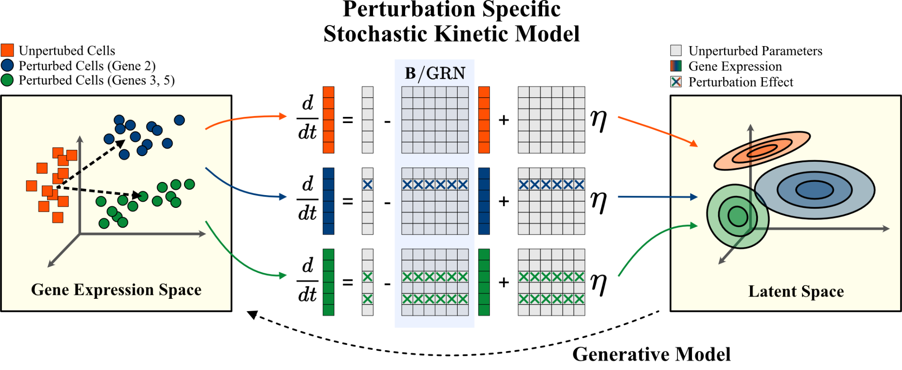

# Bicycle

Bicycle is a method to infer causal graphs with cyclic structures from observational and interventional data. Bicycle models the true (free of technical/measurement noise) causal relationships using latent variables described by the steady-state distribution of a dynamical system with unknown governing equations. A key innovation of Bicycle is that its stochastic differential equations (SDEs) are parameterized in a hierarchical fashion for each interventional condition. That is, the parameters of the SDE across conditions are identical to those of an unperturbed system, except for those genes that govern the evolution of direct interventional target variables. This approach can be interpreted as an instance of the independent causal mechanisms principle (c.f., Scholkopf et al. (2021)). The model can unravel causal relationships and predict the effect of unknown interventions while providing a directly interpretable representation of the system.

<center></center>

## Installation

We recommend to use [mamba](https://mamba.readthedocs.io/en/latest/installation/mamba-installation.html) for installing the requirements. The `environment.yaml` file includes all dependencies (both conda and pip).

1. Create a new environment:
   ```shell
   mamba env create -f environment.yml -n bicycle
   ```
   The environment installs PyTorch 2.0. Alternatively, you can also install the environment into a local folder via
   ```shell
   mamba env create -f environment.yml --prefix /path/to/local/folder/bicycle
   ```
2. Activate the environment
   ```shell
   conda activate bicycle
   ```

3. Install the `bicycle` package 
   ```shell
   pip install . --no-deps
   ```

## Reproduce Paper Results

TBD

## Run Bicycle on your own data

TBD

## Citation
Please consider citing our work, if our paper/code is relevant for your work:
```bibtex
@inproceedings{rohbeck2024causal,
  title={Bicycle: Intervention-Based Causal Discovery with Cycles},
  author={Rohbeck, Martin Clarke, Brian and Mikulik, Katharina and Pettet, Alexandra and Stegle, Oliver and Ueltzhöffer, Kai},
  booktitle={Conference on Causal Learning and Reasoning},
  year={2024},
  organization={PMLR}
}

```
